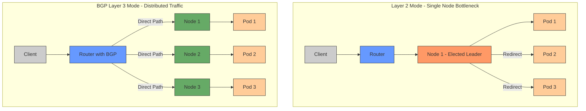

# High Availability but Lean Kubernetes Cluster

A High Availability, frugal Kubernetes cluster using [Kubespray](https://github.com/kubernetes-sigs/kubespray) optimized for Contabo VPS. Deploy enterprise-grade Kubernetes at 1/10th the cost of managed solutions.

## Key Features

- **Cost-Optimized**: €15-20/month for a 3-node cluster (vs €150-300 for managed K8s)
- **Full Kubernetes**: Latest version with containerd runtime
- **Enterprise Addons**: MetalLB, Kube-VIP, Gateway API CRDs
- **Flexible Architecture**: Single or multi-node, control-plane + worker combinations
- **Template-Based**: TypeScript templates for consistent, reproducible deployments

## Cost Comparison

| Configuration                    | HA Lean Cluster (Contabo) | AWS EKS     | GCP GKE     | Azure AKS   | Digital Ocean |
|----------------------------------|---------------------------|-------------|-------------|-------------|---------------|
| **3-node cluster (minimal)**     | €14.97/month              | ~€150/month | ~€135/month | ~€160/month | ~€60/month    |
| **3-node cluster (recommended)** | €29.97/month              | ~€300/month | ~€270/month | ~€320/month | ~€120/month   |
| **5-node cluster**               | €49.95/month              | ~€500/month | ~€450/month | ~€530/month | ~€200/month   |

### Contabo VPS vs Cloud Providers

| VPS Type  | Contabo Specs    | Contabo Price | AWS Equivalent | AWS Price   | GCP Equivalent | GCP Price   | Azure Equivalent | Azure Price |
|-----------|------------------|---------------|----------------|-------------|----------------|-------------|------------------|-------------|
| **VPS S** | 4 vCPU, 8GB RAM  | €4.99/month   | t3.large       | ~€70/month  | e2-standard-2  | ~€60/month  | B2s v2           | ~€65/month  |
| **VPS M** | 6 vCPU, 16GB RAM | €9.99/month   | t3.xlarge      | ~€140/month | e2-standard-4  | ~€120/month | B4ms v2          | ~€130/month |
| **VPS L** | 8 vCPU, 32GB RAM | €14.99/month  | t3.2xlarge     | ~€280/month | e2-standard-8  | ~€240/month | B8ms v2          | ~€260/month |

### Cost Savings Factors

- **No Control Plane Fees**: Managed K8s services charge €70-100/month for the control plane
- **Lower VM Pricing**: Contabo VPS costs 80-90% less than equivalent cloud instances
- **Included Load Balancing**: MetalLB eliminates the need for paid load balancers (€20-30/month)
- **Optimized Resource Usage**: Flexible node roles allow for efficient resource allocation

## Activated Features

- **Kubernetes Core**: v1.31.4, containerd runtime, secret encryption at rest
- **Networking**: Calico CNI, IPVS proxy mode with strict ARP, NodeLocal DNS cache
- **High Availability**: MetalLB (BGP Layer 3 mode), Kube-VIP (ARP mode), supplementary addresses in SSL keys
- **Enterprise Features**: Gateway API CRDs, secure communication

## MetalLB BGP Layer 3 Architecture

MetalLB in BGP Layer 3 mode prevents node elected bottleneck by distributing traffic more efficiently:



### Key Differences:

1. **Layer 2 Mode (ARP/NDP)**:
   - Single node elected as leader for each service IP
   - All traffic flows through the elected node
   - Creates bottleneck and single point of failure
   - Requires additional network hops for pods on other nodes

2. **Layer 3 Mode (BGP)**:
   - Each node announces routes for pods running on that node
   - Traffic is routed directly to the node hosting the pod
   - Eliminates bottleneck by distributing traffic
   - Improves fault tolerance and scalability
   - More efficient network utilization

## Quick Start

```bash
git clone https://github.com/ctnr.io/ha-lean-cluster.git
cd ha-lean-cluster
make login
make generate
make apply 
```

## Hardware Requirements

- **Minimal**: 1 Contabo VPS S (4 vCPU, 8GB RAM) - €4.99/month
- **Recommended**: 3 Contabo VPS S instances - €14.97/month

## Configuration & Node Naming

- **Core Files**: `inventory.ini.ts`, `kubeconfig.yml.ts`, `group_vars/k8s_cluster/k8s-cluster.yml.ts`, `group_vars/k8s_cluster/addons.yml.ts`
- **Node Naming**: Each node name must start with the domain name prefix (`ctnr.io-`) followed by the role:
  - Control Plane: `<domain-name>-control-plane-X[-etcd][-worker]`
  - ETCD: `<domain-name>-etcd-X`
  - Worker: `<domain-name>-worker-X[-etcd]`
  - Examples: `<domain-name>-control-plane-0-etcd`, `<domain-name>-worker-0`, `<domain-name>-etcd-0`

### ⚠️ Important Warning

**DO NOT change the first control plane node (<domain-name>-control-plane-0) without understanding the implications!**

The first control plane node is critical for cluster stability. Modifying or removing it incorrectly can cause the entire cluster to fail. If you need to replace the first control plane node, follow these steps:

1. Rename your current nodes so that `<domain-name>-control-plane-1` becomes `<domain-name>-control-plane-0` and vice versa
2. Apply the configuration
3. Only then remove the original control plane node

## Testing

The project includes automated tests to verify that key components are working correctly:

- **Ingress Testing**: Tests that the Nginx ingress controller is properly configured and can route traffic to services
  - Run with: `make test-ingress` or `deno test -A tests/ingress_test.ts`
  - The test creates a test namespace, deployment, service, and ingress with a custom domain name
  - It verifies connectivity using host-based routing with the domain name from your configuration
  - Test fixtures are located in `tests/fixtures/` directory

## Next Steps & Roadmap

- **Next**: Implement volume provisioning, configure auto-scaling, deploy workloads, add monitoring
- **Roadmap**: Automated provisioning, one-click deployment, backup solution, multi-region support, performance benchmarks

## Professional Support

Need help with setup, maintenance, or customization? Contact us directly for professional support services. We can help with:

- Initial cluster deployment and configuration
- Ongoing maintenance and updates
- Performance optimization
- Custom integrations and workload deployment
- Training and knowledge transfer

Email: contact@ctnr.io

## License

MIT License - see [LICENSE](LICENSE) file
